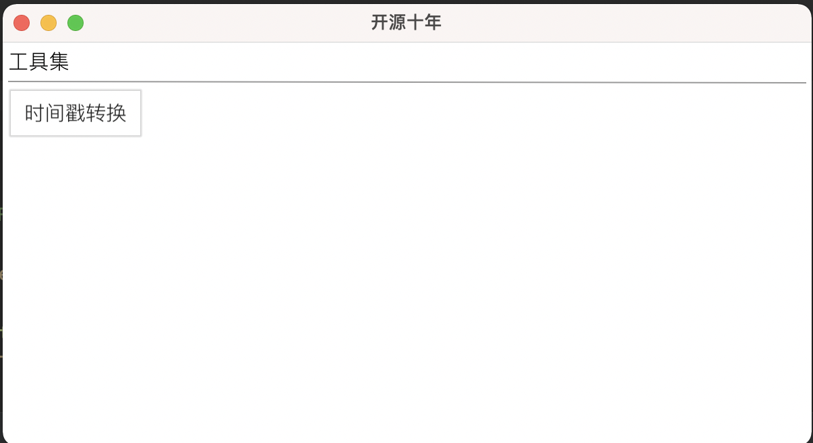
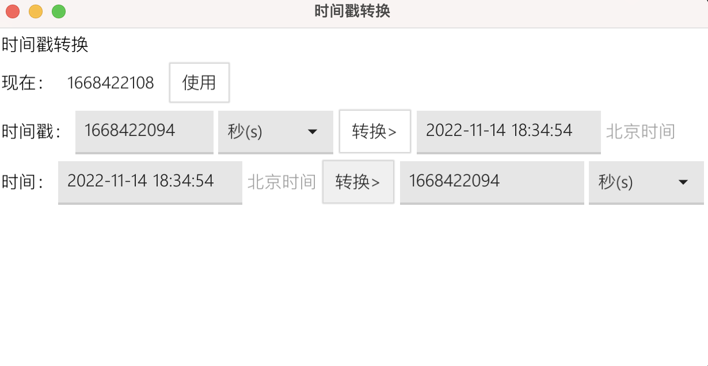

时间戳转换在日常工作中经常会用到，有没有想过为什么用时间戳而不是用日期呢？

跨平台---主要就是解决这个问题，因为不同的数据库不同的语言之间针对时间类型有不同的解释，而且有的系统date是不允许直接兼容转换的，或者你做数据迁移的时候，值好迁移但是类型怎么迁移？

所以在这个时候就凸显了时间戳的重要性。

但是时间戳就是一串数字，我们平时调试或者阅读的时候是不认识它的，所以时间戳转换就使用的非常频繁。

本节主要分享怎么使用Go实现的时间戳转换以及使用fyne实现了该功能。

#### 首先安装fyne:

```
go get fyne.io/fyne/v2
```

#### 界面开发

外观和质量缺一不可，我们使用Go一般主要做后端逻辑开发，但还是强烈建议各位玩一下前端，前后端在开发逻辑上还是有点不同的，只有都经历过才能成长为一名合格的菜鸟。

看代码：

```Go
/*
*时间戳和日期的相互转换功能实现
*params:
*app:由主界面传过来的fyne.App实例
 */
func TimeStampChange(app fyne.App) fyne.Window {
	myWindow := app.NewWindow("时间戳转换")//窗口名称
	title := canvas.NewText("时间戳转换", color.Black)//页面标题
	content := container.New(layout.NewHBoxLayout(), title, layout.NewSpacer())//控制title位置
	//获取当前时间戳
  timeNow := canvas.NewText("现在：", color.Black)
	clockTimeTamp := widget.NewLabel("")
  //时间戳输入框
	inputTimeStamp := widget.NewEntry()
	btnCopy := widget.NewButton("使用", func() {
		log.Println("tapped")
		inputTimeStamp.SetText(clockTimeTamp.Text)
	})
	//更新时间戳
	updateTime(clockTimeTamp)
	row1 := container.New(layout.NewHBoxLayout(), timeNow, clockTimeTamp, btnCopy, layout.NewSpacer())//控制显示位置
	timeStamp := canvas.NewText("时间戳：", color.Black)

	inputTimeStamp.SetPlaceHolder("输入时间戳")
	row2_1 := container.New(layout.NewGridWrapLayout(fyne.NewSize(120, 40)), inputTimeStamp)
	combo := widget.NewSelect([]string{"秒(s)", "毫秒(ms)"}, func(value string) {
		log.Println("Select set to", value)
	})
	combo.SetSelected("秒(s)")
	row2_2 := container.New(layout.NewGridWrapLayout(fyne.NewSize(100, 40)), combo)
	//转换结果显示
  turnResult := widget.NewEntry()
	turnResult.SetPlaceHolder("转换结果")
	row2_3 := container.New(layout.NewGridWrapLayout(fyne.NewSize(160, 40)), turnResult)
  //根据用户选择的秒还是毫秒来进行转换
	btnTurn := widget.NewButton("转换>", func() {
		var timetamp = ""
		if combo.Selected == "秒(s)" {
			timetamp = timeStamps2Date(inputTimeStamp.Text)
		} else {
			timetamp = timeStampMs2Date(inputTimeStamp.Text)
		}
		turnResult.SetText(timetamp)
	})
	beijingTimeStr := canvas.NewText("北京时间", color.Gray{0x99})
	row2 := container.New(layout.NewHBoxLayout(), timeStamp, row2_1, row2_2, btnTurn, row2_3, beijingTimeStr)
	//下面同理，是上面的逆序
	timeDate := canvas.NewText("时间：", color.Black)
	inputDate := widget.NewEntry()
	inputDate.SetPlaceHolder("请输入日期")
	row3_1 := container.New(layout.NewGridWrapLayout(fyne.NewSize(160, 40)), inputDate)
	beijingTimeStr1 := canvas.NewText("北京时间", color.Gray{0x99})
	turnResult_date := widget.NewEntry()
	combo_date := widget.NewSelect([]string{"秒(s)", "毫秒(ms)"}, func(value string) {
		log.Println("Select set to", value)
	})
	combo_date.SetSelected("秒(s)")
	row3_2 := container.New(layout.NewGridWrapLayout(fyne.NewSize(100, 40)), combo_date)
	btnTurn_date := widget.NewButton("转换>", func() {
		var timetamp = ""
		if combo_date.Selected == "秒(s)" {
			timetamp = date2timeStamps(inputDate.Text)
		} else {
			timetamp = date2timeStampMs(inputDate.Text)
		}
		turnResult_date.SetText(timetamp)
	})

	turnResult_date.SetPlaceHolder("转换结果")
	row3_3 := container.New(layout.NewGridWrapLayout(fyne.NewSize(160, 40)), turnResult_date)
	row3 := container.New(layout.NewHBoxLayout(), timeDate, row3_1, beijingTimeStr1, btnTurn_date, row3_3, row3_2)
	//最后把上面画的页面都装进布局里面，排序
	myWindow.SetContent(container.New(layout.NewVBoxLayout(), content, row1, row2, row3))
	myWindow.Resize(fyne.NewSize(600, 300))
	go func() {
		for range time.Tick(time.Second) {
			updateTime(clockTimeTamp)
		}
	}()
  //最后把这个窗口返回给app，那边在用户点击的时候会调用show去显示出来
	return myWindow
}
```


#### 工具函数准备

提到时间戳大多都知道秒和毫秒两种，有的时候用毫秒有的时候用秒，毫秒要比秒更加的精确。两者之间是1000倍的一个差距，所以在准备转换函数时我们也做两手准备：

```Go

//秒时间戳转日期
func timeStamps2Date(timestamp string) string {
	timetamp, _ := strconv.Atoi(timestamp)
	timeTemplate := "2006-01-02 15:04:05"//在Go里面用这个格式不要换不然你会发现新大陆哦~（文末有彩蛋）
	tm := time.Unix(int64(timetamp), 0)
	timeStr := tm.Format(timeTemplate)
	return timeStr
}

//日期转秒时间戳
func date2timeStamps(dateStr string) string {
	TimeLocation, _ := time.LoadLocation("Asia/Shanghai") //获取北京时间时区，很重要
	times, _ := time.ParseInLocation("2006-01-02 15:04:05", dateStr, TimeLocation)
	timeUnix := times.Unix()
	return strconv.Itoa(int(timeUnix))
}

//毫秒时间戳转日期
func timeStampMs2Date(timestamp string) string {
	timetamp, _ := strconv.Atoi(timestamp)
	timeTemplate := "2006-01-02 15:04:05"
	tm := time.UnixMilli(int64(timetamp))
	timeStr := tm.Format(timeTemplate)
	return timeStr
}

//日期转毫秒时间戳
func date2timeStampMs(dateStr string) string {
	TimeLocation, _ := time.LoadLocation("Asia/Shanghai") //获取北京时间时区，很重要
	times, _ := time.ParseInLocation("2006-01-02 15:04:05", dateStr, TimeLocation)
	timeUnix := times.UnixMilli()
	return strconv.Itoa(int(timeUnix))
}
```

上面的代码基本瞜一眼也就明白怎么回事了，但是其中有两点要注意：

- 格式化日期必要按照代码中的来；
- 日期转时间戳必须先获取时区；

#### END

完成，截止目前该功能已经完成了，我们看一下效果：



这是主界面（无设计，纯程序员视觉0.0）



这是具体功能是使用界面 :(

#### 彩蛋

为什么在Go里面要用”2006-01-02 15:04:05“固定格式？

不管是java还是php亦或者其他语言没有这么玩的，为什么Go就是这么另类呢？

其实呀，它这个设计还真的是别出心裁。

针对常规的格式转换我们直接yyyy-mm-dd肯定方便呀，但是在有些语言里面处理 22年11月14日这种格式的时候就麻爪了，不去好好百度百度基本你是写不出来的。

而用Go就好办了，只要对应的值改一下就行”06-01-02 15:04:05“

Go设计原则之一就是：大道至简，在设计的时候是有道道可讲的，是按照ANSIC标准的日期格式，月、日、时、分、秒、年，最后再加上MST时区，分别对应1 2 3 4 5 6 7，同时还可以随意加星期几。有兴趣的话可以去好好研究下，对于我们菜鸟来说记住这个日期就行了。

