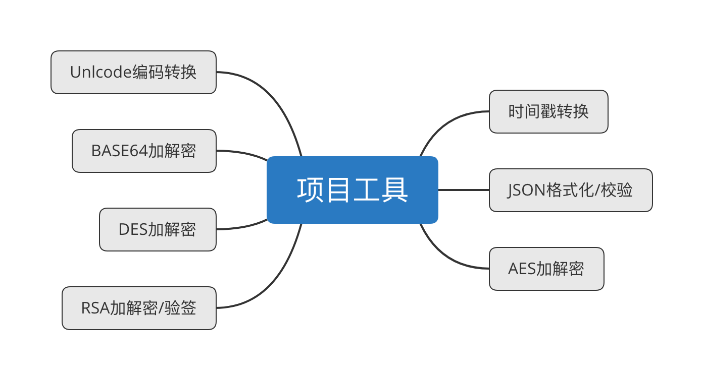

### 项目名称

中文：开源十年-工具集（离线）

英文：ToolsBaBa

### 项目说明

该项目是要做一个程序员常用的工具包：

1、可直接用于项目开发中；

2、可打包成.app/.exe安装与PC端离线使用；

3、公开其算法/方法/代码等，供大家学习;

在程序员的日常开发中会经常用到这些工具，但大多数的工具都需在线使用，对那些经常出差或者不允许使用外网的来说就很难受。其次这些tools原理虽简单但其中很多道道很多人都是知其然不知其所以然，反正需要用了就去百度扒拉，而网上寻来的质量或者使用角度也参差不齐，故提供这么一个工具集来共同学习。

### 项目结构介绍

/doc:项目资料文档

/FeatureXXX :子功能文件夹

### 工具集-第一季规划内容

### 语言及框架要求：

该功能使用Go语言实现，框架选择fyne：https://developer.fyne.io/

### 界面要求：

简洁明了即可

### 注释要求：

- 参考https://github.com/kaiyuan10nian/kaiyuan10nian 开发公约中的约定
- 注明函数及文件作用用途，以及自认该备注介绍部分；

### 介绍文档：

需提供该功能模块的介绍，包括但不限于：功能实现原理、使用到的函数来源及功能介绍、实现功能时自己的所感所想、代码部分的介绍等等，主要目的是分享给大家学习。

##### 1、时间戳转换

状态：【已认领2022-11-10】【已完成2022-11-14】

认领人：【开源十年】

审核人：【九鱼测试完毕】

功能要求：

- 显示当前时间戳；
- 输入时间戳可转换为日期格式；
- 输入日期可转换为时间戳格式；
- 提供秒/毫秒两种规格；

##### 2、JSON格式化及校验

状态：【未认领】

认领人：【待定】

审核人：【待定】

- 提供输入框，可随意填充内容进去；
- 格式化，把输入框的内容以常见的json格式呈现出来；
- 校验，校验输入的内容是否符合json格式，不符合指出原因所在；

##### 3、AES加解密

状态：【未认领】

认领人：【待定】

审核人：【待定】

- AES加密模式可选择：CBC、EBC...；
- 填充可选择：PKCS0/5/7/iso...;
- 秘钥长度可选择：128/192/256...;
- 秘钥：提供输入框
- 偏移量：提供输入框
- 输出可选择：Base64/hex...;
- 提供加密/界面功能并输出加密/解密后的结果;

##### 4、DES加解密

状态：【未认领】

认领人：【待定】

审核人：【待定】

- AES加密模式可选择：CBC、EBC...；
- 填充可选择：PKCS0/5/7/iso...;
- 秘钥长度可选择：128/192/256...;
- 秘钥：提供输入框
- 偏移量：提供输入框
- 输出可选择：Base64/hex...;
- 提供加密/界面功能并输出加密/解密后的结果;

##### 5、RSA加解密

状态：【未认领】

认领人：【待定】

审核人：【待定】

- 提供输入框接收私钥和加密/解密等内容；
- 校验私钥格式(pem格式秘钥)是否正确;
- 提供加密/界面功能并输出加密/解密后的结果;

##### 6、BASE64加解密

状态：【未认领】

认领人：【待定】

审核人：【待定】

- 提供输入框，可输入要加密/解密的内容;
- 提供加密/解密功能并输出加密/解密后的结果;

##### 7、Unlcode转换

状态：【未认领】

认领人：【待定】

审核人：【待定】

- 提供输入框，可输入要转换的内容;

- 提提供中文转unicode/unicode转中文/unicode转ASCII/ASCII转Unicode/中文转&#XXXX格式等功能并输出对应结果；

